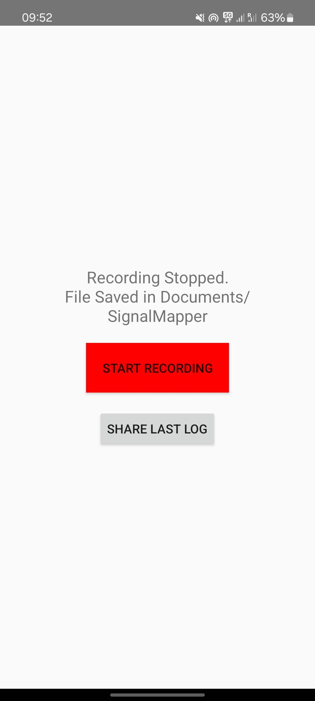
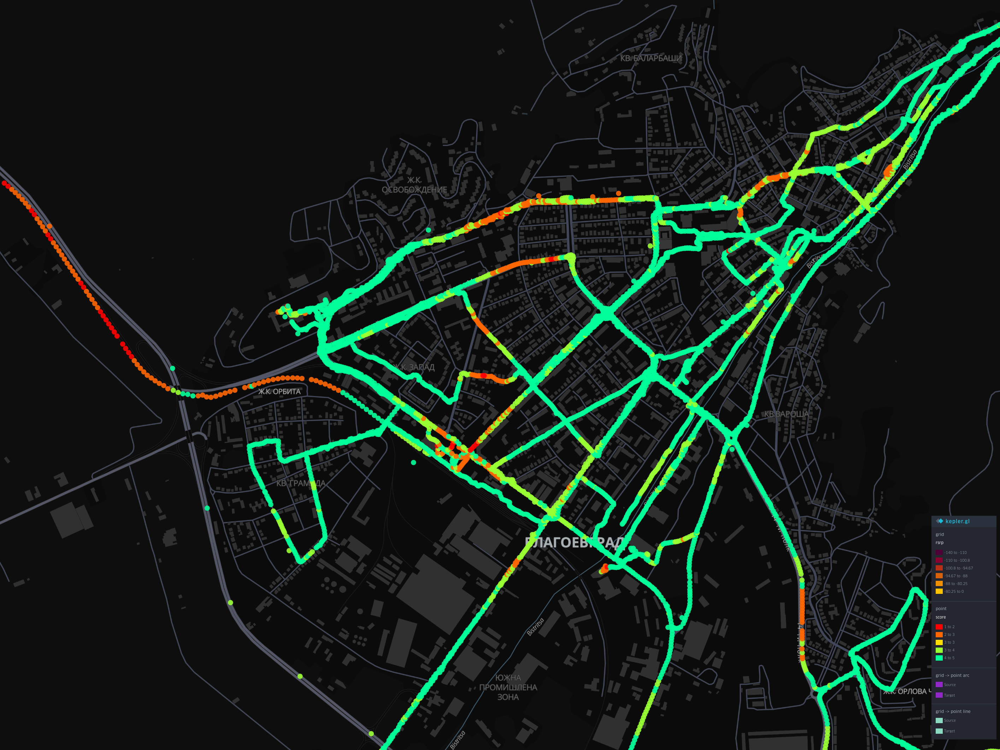

# Cellular Signal Mapper & Analysis Suite
### by Ramazan Ertugrul Aydogan


This project consists of two parts: a native **Android Application** to log cellular telemetry (RSRP, SNR, PCI) and a **Python Analysis Suite** to process that data into engineering reports and coverage heatmaps.

## 📸 Project Visuals

### 📱 Android Application
| Main Interface | Real-time Logging |
|:---:|:---:|
|  |  |
| *Status Dashboard* | *Active Data Collection* |

### 🗺️ Coverage Heatmap

*Generated Signal Heatmap (RSRP/SNR) visualized in Kepler.gl*

## 📱 1. Android Application
Located in the root directory (`/app`).
*   **Language:** Kotlin
*   **Key Features:**
    *   **Dual-SIM Support:** Logs A1/Yettel/Vivacom simultaneously using `SubscriptionManager` API.
    *   **Background Service:** Uses `ForegroundService` with `WakeLock` for continuous 1Hz logging (screen off support).
    *   **High-Accuracy GPS:** Forces `FusedLocationProvider` into high-priority mode for vehicular speed tracking.

## 📊 2. Analysis Scripts
Located in `/analysis_scripts`.

### 🧠 Core Analysis
*   **`network_analyzer.py`**: The main engine. Parses CSV logs, filters stationary data, detects spectrum pollution, and calculates "Ping-Pong" handover rates.
*   **`device_comparison.py`**: A hardware benchmarking tool. Matches GPS points between two devices (e.g., S25 Ultra vs A52s) to determine antenna sensitivity differences.

### 🗺️ Mapping & Visualization
*   **`map_visualizer.py`**: Automates high-resolution map rendering using Playwright (browser automation) to capture 4K screenshots of Kepler.gl heatmaps.
*   **`geo_resolver.py`**: Converts raw Google Maps URLs and dropped pins into clean Latitude/Longitude coordinates for the dataset.

### 📷 Legacy Support
*   **`ocr_processor.py`**: Uses Tesseract OCR to extract signal data from ServiceMode screenshots (used when API access is restricted).

## 🚀 How to Run

### Part A: The Android App
1.  Open the root folder in **Android Studio**.
2.  Build the APK and install it on a device.
3.  Grant Location and Phone State permissions.

### Part B: The Analysis
1.  Install Python dependencies:
    ```bash
    pip install pandas numpy matplotlib pytesseract requests playwright
    playwright install
    ```
2.  Run the analyzer on your logs:
    ```bash
    python analysis_scripts/network_analyzer.py
    ```

---
*Developed for Cellular Network Auditing Research.*
