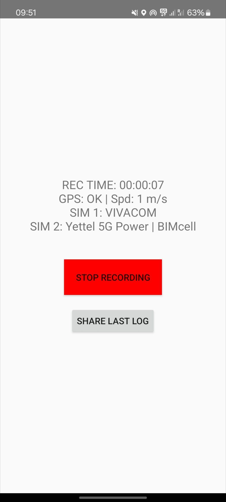
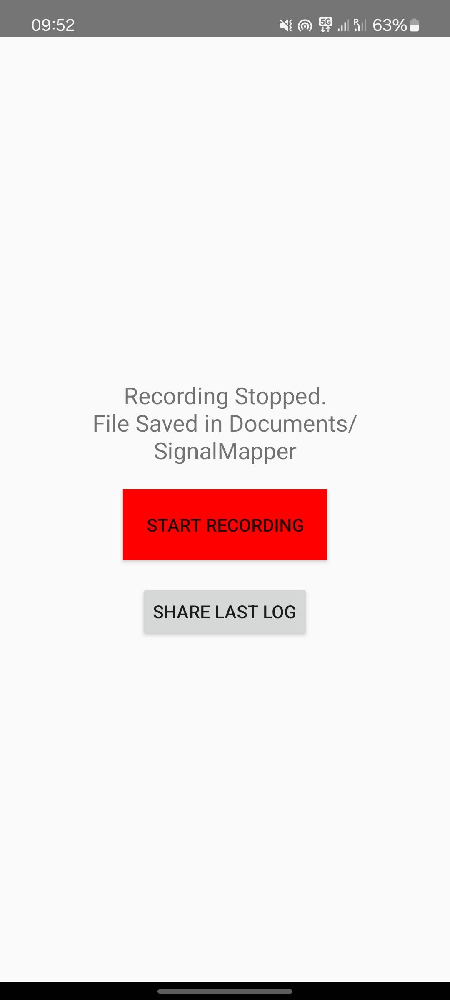
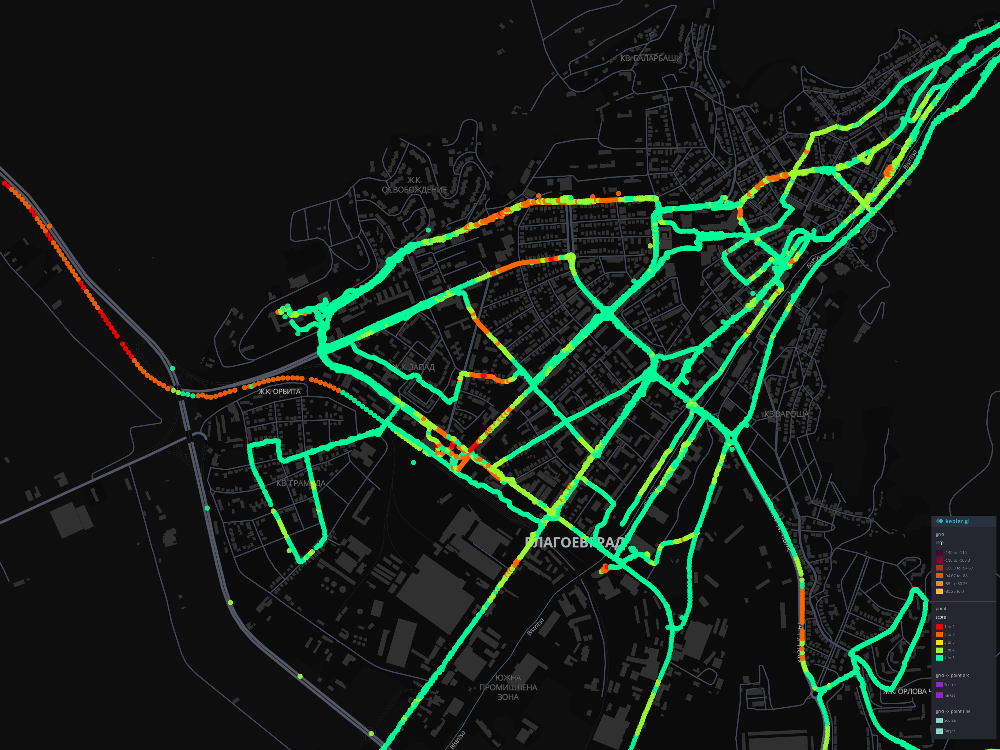

📶 Cellular Signal Mapper & Analysis Suite
by Ramazan Ertugrul Aydoğan

A comprehensive toolkit for auditing cellular network coverage (4G/LTE/5G), benchmarking hardware performance, and generating high-fidelity signal heatmaps natively on-device or via Python data science tools.
This project was originally developed to map the network topology of Blagoevgrad, Bulgaria, comparing three major national carriers. However, the software is universal and works with any carrier globally.
⚖️ Disclaimer: To maintain neutrality and avoid potential commercial conflicts, the specific names of the telecom operators analyzed in this study have been anonymized (referred to as Operator 01F, 03F, and 05F).
✨ What's New in the Latest Version (v1.22+)
The Android app has been entirely rewritten from the ground up:
Jetpack Compose UI: A modern, swipeable tab interface featuring Dark/Light mode.
Native Offline Mapping (OSMDroid): Generate and view signal coverage heatmaps directly inside the app without needing a PC. Features bounding-box GPU rendering to smoothly handle 100k+ data points.
Live Lock-Screen Telemetry: Real-time multi-SIM tracking directly on the lock screen (Operator, Tech, RSRP).
On-Device Data Processing: The app now natively filters "ghost" stationary points and standardizes dynamic carrier names before generating maps.
Android 14 Ready: Full support for FOREGROUND_SERVICE_LOCATION and modern FileProvider sharing.
📸 Project Visuals
📱 Android Application (v1.22+ Compose UI)
Live Recording & Stats	Interactive Native Map
	
Swipeable Dashboard & Live Stats	On-Device RSRP Heatmap Filtering
🗺️ Advanced Coverage Heatmap (Python)

*High-Fidelity Signal Heatmap (RSRP/SNR) visualized via Kepler.gl*
📂 Project Structure
1. The Android App (/app)
A native Kotlin application designed for professional "Drive Testing" without expensive hardware.
Foreground Service & WakeLock: Keeps the CPU and GPS active to log data even when the screen is off (pocket logging), bypassing Android battery restrictions.
High-Precision GPS: Forces the FusedLocationProvider into high-accuracy mode (1000ms intervals) to map signal dips to exact street corners.
Telemetry Recorded: RSRP, SNR/RSRQ, PCI, Network Type (2G/3G/4G/5G).
Live Processing: Automatically standardizes messy network APIs and filters out stationary data points on the fly to keep file sizes lean.
2. The Analysis Suite (/analysis_scripts)
Python scripts to turn raw CSV logs into engineering insights (for heavy-duty data science beyond the app's native capabilities).
🧠 network_analyzer.py (The Core Engine)
Processes the CSV logs to generate a full network audit.
Spectrum Pollution Detection: Identifies areas with strong signal (High RSRP) but unusable quality (Low SNR).
Handover Analysis: Calculates how often the phone switches towers ("Ping-Pong effect").
⚔️ device_comparison.py (Hardware Benchmark)
A tool to compare antenna sensitivity between two phones. Matches GPS timestamps to calculate average dBm differences.
🗺️ map_visualizer.py & geo_resolver.py
Tools for resolving Google Maps coordinates and automating ultra high-res heatmap rendering for presentations.
⚠️ Hardware & SNR Limitations
Not all phones support SNR (Signal-to-Noise Ratio) reporting.
The ability to read SNR/SINR depends entirely on the specific Modem, CPU, and Firmware implementation of the device. Many manufacturers hide this metric in the low-level firmware, making it inaccessible to standard Android apps (unless the phone is Rooted to access the modem directly).
Tested Device Compatibility:
| Device Model | RSRP (Strength) | SNR (Quality) | Status |
| :--- | :---: | :---: | :--- |
| Samsung Galaxy A52s | ✅ Yes | ✅ Yes | Fully Supported |
| Samsung S25 Ultra | ✅ Yes | ✅ Yes | Fully Supported |
| Samsung M51 | ✅ Yes | ❌ No | Partial (RSRP only) |
| Xiaomi 14 | ✅ Yes | ❌ No | Partial (RSRP only) |
If your device logs 0.0 or N/A for SNR, this is a firmware limitation, not a bug in the app.
🚀 How to Run
Part A: The Android App
Option 1: Quick Install (No Coding Required)
If you want to use the tool immediately without Android Studio:
Download SignalMapper_APK.zip from the file list above.
Extract the ZIP file to get the .apk.
Transfer the file to your Android phone.
Tap to install. (Allow "Install from Unknown Sources" if prompted).
Crucial: On first launch, grant Location (Always) and Phone State permissions manually.
Option 2: Build from Source (Developers)
Open the root folder in Android Studio (Koala or newer recommended for Jetpack Compose).
Sync Gradle and run the app on a connected device running Android 8.0+.
Part B: The Analysis (Python)
Install the required Python libraries:
code
Bash
pip install pandas numpy matplotlib pytesseract requests playwright
playwright install
Export your CSV logs from the app using the "Share Last Log" button.
Place them in the analysis_scripts folder.
Run the analyzer:
code
Bash
python analysis_scripts/network_analyzer.py
🔬 Research Findings (Sample)
Based on 300,000+ data points collected in Blagoevgrad:
Operator 01F: "Performance King" - Highest peak speeds and aggressive tower switching (60 switches/min).
Operator 05F: "Consistency King" - Fewest dead zones and balanced handover logic.
Operator 03F: "Conservative" - Sticky connections; holds onto distant towers too long, causing high spectrum pollution.
Hardware Insight: The mid-range Samsung A52s (plastic back) often outperformed the flagship S25 Ultra (metal/glass) in raw signal reception by ~1.2 dBm due to RF transparency.
Created for the South-West University "Neofit Rilski" Engineering Department.

