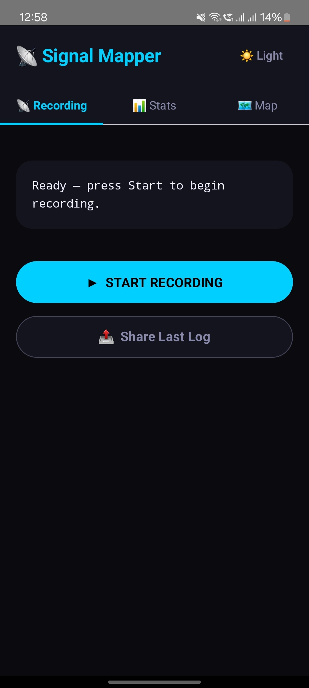
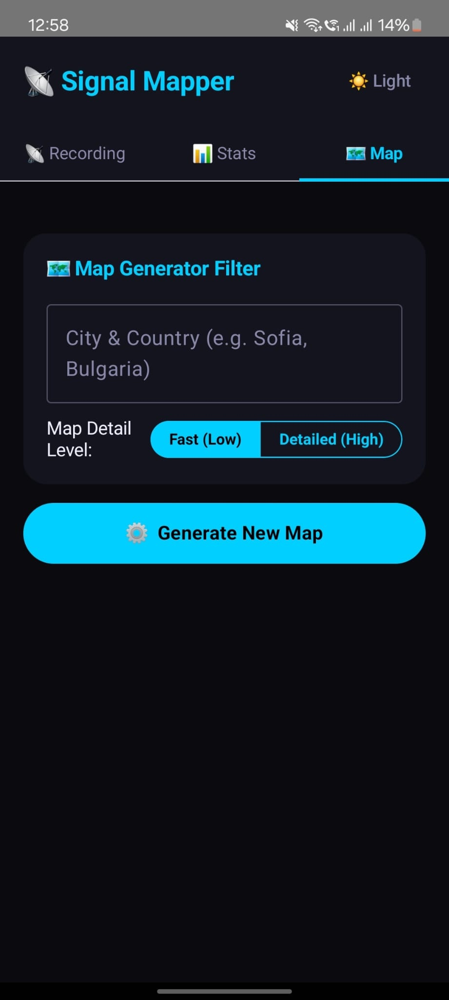

# 📶 Cellular Signal Mapper & Analysis Suite
### by Ramazan Ertuğrul Aydoğan


A comprehensive toolkit for auditing cellular network coverage (4G/LTE/5G), benchmarking hardware performance, and generating high-fidelity signal heatmaps — natively on-device, synced to a personal server, or via Python data science tools.

This project was originally developed to map the network topology of **Blagoevgrad, Bulgaria**, comparing three major national carriers. However, the **software is universal** and works with any carrier globally.

> **⚖️ Disclaimer:** To maintain neutrality and avoid potential commercial conflicts, the specific names of the telecom operators analyzed in the original study have been anonymized (referred to as **Operator 01F, 03F, and 05F**).

---

## 🏆 Academic Recognition

The research behind this project was awarded **Best Student Paper Award** and published on IEEE Xplore. Read it here: [IEEE Xplore Publication](https://ieeexplore.ieee.org/document/11583596).

Special thanks to Blagovest Nikolaev Atanasov and Gabriela Atanasova, and to the South-West University "Neofit Rilski" Engineering Department for supporting the original research.

---

## ✨ What's New — ATOMS2026

The app has moved well past a drive-testing tool into a full personal network-history platform. Highlights over the previous public build:

*   **Persistent Identity & Onboarding:** A one-time setup flow now writes your profile to `Documents/SignalMapper/profile.json` — survives reinstalls, no more losing your settings and history every time you update.
*   **Trip Companion:** Set a destination and the app calculates a live ETA from your GPS speed, alerts you before you arrive, auto-starts recording, and pre-caches offline map tiles along your route so you're never staring at a blank map in a dead zone.
*   **Smarter Recording:** Adaptive GPS polling (slows down when you're stationary), plus a configurable battery-based auto-stop so recording can't drain your phone to zero.
*   **Fog of War Map Mode:** Reveals only the ~110m map cells you've actually explored — plus a City/Road/Satellite tile switcher and a triangulated cell-tower overlay estimated purely from your own signal readings.
*   **Graphs, Stats & Achievements:** A local database now indexes every log so per-city signal distributions, 100m road-segment comparisons, and unlockable badges all load instantly instead of re-parsing raw CSVs on demand.
*   **Online & Territory:** See who else is currently recording, check a live leaderboard, and play an anonymous territory-capture game against other users based on exploration density.
*   **Resilient Sync:** Uploads are now zipped with device/battery metadata, retried instantly on Wi-Fi reconnect, and protected against race conditions — no more silently-lost sessions.
*   **Home-Screen Widget:** Start/stop recording without opening the app.

---

## 📸 Project Visuals

### 📱 Core Recording & Map

| Live Recording & Stats | Interactive Native Map |
|:---:|:---:|
|  |  |
| *Swipeable Dashboard & Live Stats* | *On-Device RSRP Heatmap Filtering* |

### 🆕 New in ATOMS2026

| Onboarding & Identity | Trip Companion |
|:---:|:---:|
|  |  |
| *First-launch setup & persistent profile* | *Live ETA, alerts & auto-recording* |

| Fog of War / Tile Modes | Graphs, Stats & Achievements |
|:---:|:---:|
|  |  |
| *Explored-cell reveal, City/Road/Satellite tiles* | *Badges, road comparisons, signal distributions* |

| Online & Leaderboard | Territory Game |
|:---:|:---:|
|  |  |
| *Who's online now, global stats* | *Capture cells through exploration* |

### 🗺️ Advanced Coverage Heatmap (Python)


*High-Fidelity Signal Heatmap (RSRP/SNR) visualized via Kepler.gl*

---

## 📂 Project Structure

### 1. The Android App (`/app`)

A native Kotlin application designed for professional "Drive Testing" without expensive hardware — now with a full personal-tracking layer on top.

*   **Foreground Service & WakeLock:** Keeps the CPU and GPS active to log data even when the screen is off (pocket logging), bypassing Android battery restrictions.
*   **High-Precision, Adaptive GPS:** Runs the `FusedLocationProvider` in high-accuracy mode, dynamically adjusting poll frequency to your movement speed to save battery.
*   **Telemetry Recorded:** RSRP, SNR/RSRQ, PCI, Network Type (2G/3G/4G/5G), plus device metadata (model, battery, app version) on every upload.
*   **Trip Companion:** Geocoded destinations, Haversine-based ETA, proximity alerts, and automatic offline tile pre-caching for the route ahead.
*   **Local Database Indexing:** Every CSV log is indexed into a local Room database in the background, so map generation and stats no longer re-parse raw files every time.
*   **Persistent Identity:** A `profile.json` outside app-private storage keeps your username, badges, and settings intact across reinstalls.
*   **Android 14 Ready:** Full support for `FOREGROUND_SERVICE_LOCATION`, `POST_NOTIFICATIONS`, and modern `FileProvider` sharing.

### 2. The Server (`/server`)

A lightweight Python/Flask backend (self-hosted, e.g. on a Raspberry Pi) that receives uploads, tracks online status, runs the leaderboard and territory game, and serves update checks — none of this is required to use the app's on-device features, but it powers the community/sync layer.

### 3. The Analysis Suite (`/analysis_scripts`)

Python scripts to turn raw CSV logs into engineering insights (for heavy-duty data science beyond the app's native capabilities).

#### 🧠 `network_analyzer.py` (The Core Engine)

Processes the CSV logs to generate a full network audit.

*   **Spectrum Pollution Detection:** Identifies areas with strong signal (High RSRP) but unusable quality (Low SNR).
*   **Handover Analysis:** Calculates how often the phone switches towers ("Ping-Pong effect").

#### ⚔️ `device_comparison.py` (Hardware Benchmark)

A tool to compare antenna sensitivity between two phones. Matches GPS timestamps to calculate average dBm differences.

#### 🗺️ `map_visualizer.py` & `geo_resolver.py`

Tools for resolving Google Maps coordinates and automating ultra high-res heatmap rendering for presentations.

---

## ⚠️ Hardware & SNR Limitations

**Not all phones support SNR (Signal-to-Noise Ratio) reporting.**

The ability to read SNR/SINR depends entirely on the specific **Modem, CPU, and Firmware** implementation of the device. Many manufacturers hide this metric in the low-level firmware, making it inaccessible to standard Android apps (unless the phone is Rooted to access the modem directly).

**Tested Device Compatibility:**

| Device Model | RSRP (Strength) | SNR (Quality) | Status |
| :--- | :---: | :---: | :--- |
| **Samsung Galaxy A52s** | ✅ Yes | ✅ Yes | **Fully Supported** |
| **Samsung S25 Ultra** | ✅ Yes | ✅ Yes | **Fully Supported** |
| **Samsung M51** | ✅ Yes | ❌ No | Partial (RSRP only) |
| **Xiaomi 14** | ✅ Yes | ❌ No | Partial (RSRP only) |

*If your device logs `0.0` or `N/A` for SNR, this is a firmware limitation, not a bug in the app.*

---

## 🚀 How to Run

### Part A: The Android App

#### Option 1: Quick Install (No Coding Required)

If you want to use the tool immediately without Android Studio:

1.  Download the latest SignalMapper.apk from the releases page.
2.  Tap to install. (Allow "Install from Unknown Sources" if prompted).
3.  On first launch, complete the short onboarding flow — this sets your display name and preferences and creates your persistent profile.
4.  **Crucial:** Grant **Location (Always)**, **Phone State**, and **Notifications** permissions when prompted, plus **All Files Access** if you're on Android 11+.

#### Option 2: Build from Source (Developers)

1.  Open the root folder in **Android Studio** (Koala or newer recommended for Jetpack Compose).
2.  Sync Gradle and run the app on a connected device running Android 8.0+.

### Part B: The Server (Optional — for sync/leaderboard/territory)

1.  Requires Python 3 + Flask on any always-on machine (a Raspberry Pi works well).
2.  Set your `SIGNAL_API_TOKEN` as an environment variable rather than relying on the source default.
3.  Run `python server.py` — it listens on port 5055 by default.

### Part C: The Analysis (Python)

1.  Install the required Python libraries:

    ```bash
    pip install pandas numpy matplotlib pytesseract requests playwright
    playwright install
    ```

2.  Export your CSV logs from the app using the "Share Last Log" button.
3.  Place them in the `analysis_scripts` folder.
4.  Run the analyzer:

    ```bash
    python analysis_scripts/network_analyzer.py
    ```

---

## 🔬 Research Findings (Sample)

*Based on 300,000+ data points collected in Blagoevgrad:*

*   **Operator 01F:** "Performance King" - Highest peak speeds and aggressive tower switching (60 switches/min).
*   **Operator 05F:** "Consistency King" - Fewest dead zones and balanced handover logic.
*   **Operator 03F:** "Conservative" - Sticky connections; holds onto distant towers too long, causing high spectrum pollution.
*   **Hardware Insight:** The mid-range **Samsung A52s** (plastic back) often outperformed the flagship **S25 Ultra** (metal/glass) in raw signal reception by ~1.2 dBm due to RF transparency.

---
*Created for the South-West University "Neofit Rilski" Engineering Department.*  

